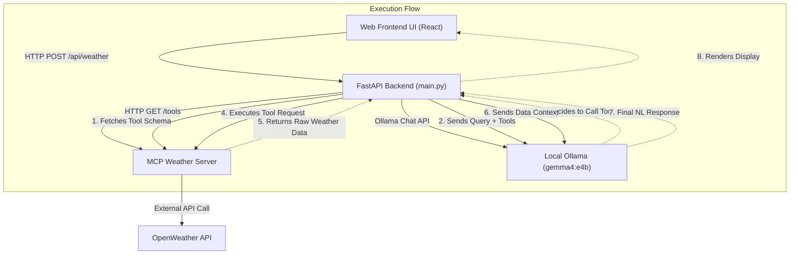

# Weather App - MCP Demo Architecture

## Overview
This application demonstrates the power of the **Model Context Protocol (MCP)** by integrating a local LLM (`gemma4:e4b` via Ollama) with external tools. It enables users to query real-time weather information through a beautiful web interface, leveraging the LLM to understand intent and natural language.

## Architecture Diagram

## Components

### 1. Web Frontend
- **Tech Stack**: React/Vite with Vanilla CSS (Premium Glassmorphism Design, Framer Motion, Lucide Icons)
- **Current Directory**: `frontend/`
- **Responsibility**: Provides a highly interactive and visually stunning user interface. It features a dropdown menu of popular cities and dynamic, animated cards to display the generated response. It acts as the primary user touchpoint, sending requests to the backend.

### 2. LLM / MCP Client (Backend)
- **Tech Stack**: Python, FastAPI, Ollama Python Client, Requests
- **Current File**: `main.py` 
- **Responsibility**: Acts as the intelligent orchestrator.
  - Dynamically fetches available tools from the connected MCP Server.
  - Parses and translates the MCP tool schema into a format compatible with Ollama's function calling.
  - Forwards the user's prompt to the local `gemma4:e4b` model.
  - Executes any tool calls requested by the model, capturing the raw JSON results.
  - Feeds the results back into the context window for the LLM to synthesize a conversational, accurate response.

### 3. MCP Weather Server
- **Tech Stack**: Python, FastAPI, Requests
- **Current File**: `mcp_weather_server.py`
- **Responsibility**: A standalone server that exposes tools conforming to the Model Context Protocol. Specifically, it provides the `get_weather` tool which securely interacts with the OpenWeather API (using a configured API key) to retrieve real-time temperature, humidity, wind conditions, and a weather description.

### 4. Local LLM (Ollama)
- **Model**: `gemma4:e4b`
- **Responsibility**: Handles natural language understanding and tool-calling execution locally on the machine. It is responsible for routing the query to the correct tool with the appropriate arguments (e.g., extracting "New York" from the user's message) and generating a seamless response based on the fetched data.
