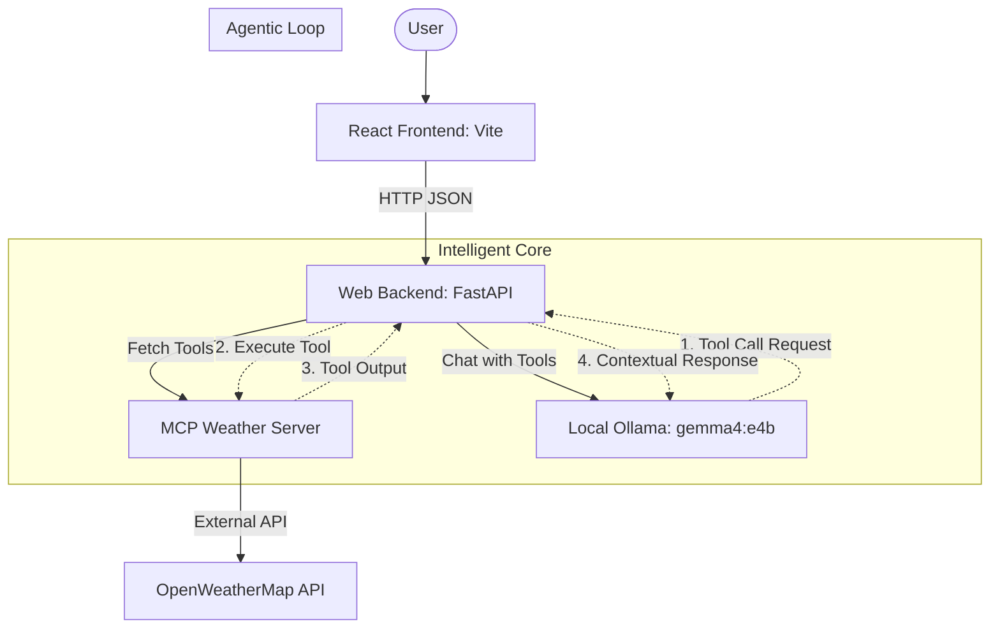

# SkyMCP: Web Weather App Architecture

## Overview
SkyMCP is a premium, AI-powered weather dashboard that demonstrates the **Model Context Protocol (MCP)**. It bridges a modern React frontend with a local LLM (`gemma4:e4b`) that intelligently uses an MCP-compliant weather tool to fetch real-time data.

## Architecture Diagram

## Detailed Component Breakdown

### 1. Web Frontend (UI Layer)
- **Technology**: React, Vite, Framer Motion, Lucide Icons, Vanilla CSS.
- **Design Philosophy**: Glassmorphism with vibrant mesh gradients and smooth micro-animations.
- **Responsibility**: Provides a high-end interface for users to select cities from a curated list. It handles the display of synthesized natural language reports from the AI.

### 2. Web Backend (Orchestration Layer)
- **File**: `main.py`
- **Technology**: FastAPI, Requests, Pydantic.
- **Responsibility**: 
    - Exposes RESTful endpoints for the frontend (`/api/cities`, `/api/weather`).
    - Acts as the **MCP Client**, dynamically discovering tools from the MCP Server.
    - Manages the conversation state and handles the agentic loop between the LLM and tools.

### 3. MCP Weather Server (Tool Layer)
- **File**: `mcp_weather_server.py`
- **Technology**: FastAPI.
- **Responsibility**: Implements the Model Context Protocol. It exposes the `get_weather` tool, abstracting the complexity of the OpenWeather API into a standardized tool schema that any MCP-compatible LLM can use.

### 4. Local LLM (Intelligence Layer)
- **Model**: `gemma4:e4b` (via Ollama).
- **Responsibility**: 
    - **NLU**: Understands user requests like "What's the weather in Tokyo?".
    - **Tool Use**: Intelligently decides when to call the `get_weather` tool based on the provided MCP schemas.
    - **Synthesis**: Combines raw weather data (temp, humidity, etc.) into a friendly, natural language summary.

## Data Flow
1. User selects a city in the **React UI**.
2. UI sends a request to the **Web Backend**.
3. Backend fetches tool definitions from the **MCP Server**.
4. Backend sends the user query + tool definitions to **Ollama**.
5. **Gemma 4** requests a tool call; Backend executes it via the **MCP Server**.
6. **MCP Server** fetches data from **OpenWeather**.
7. Backend sends raw data back to **Gemma 4** for final synthesis.
8. The final natural language response is streamed back to the **React UI**.
